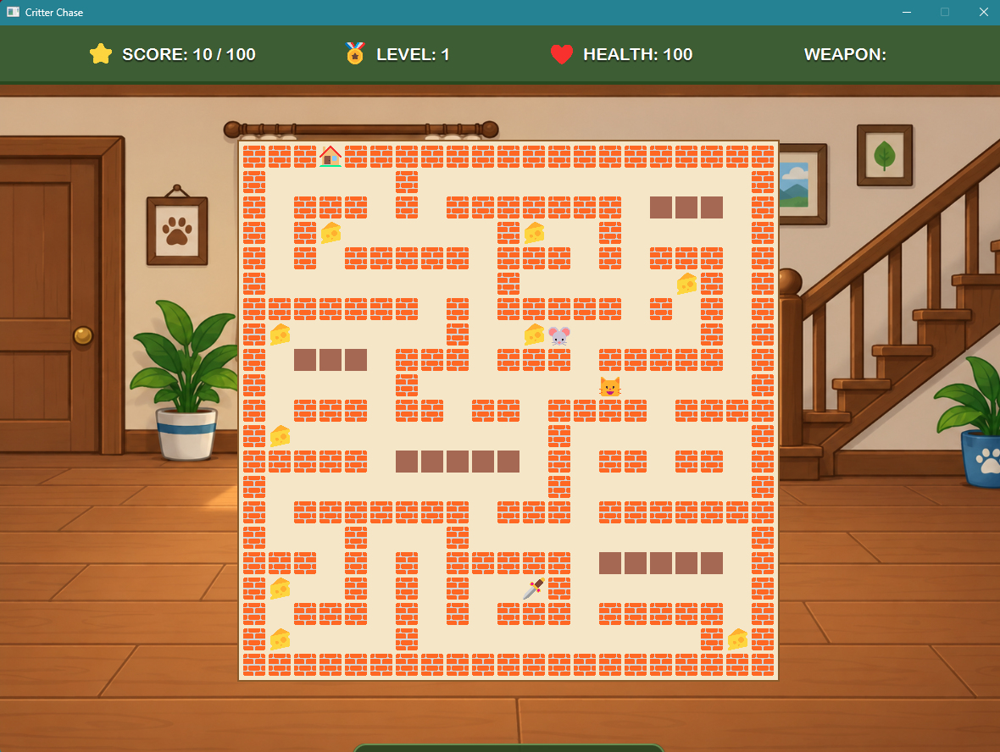
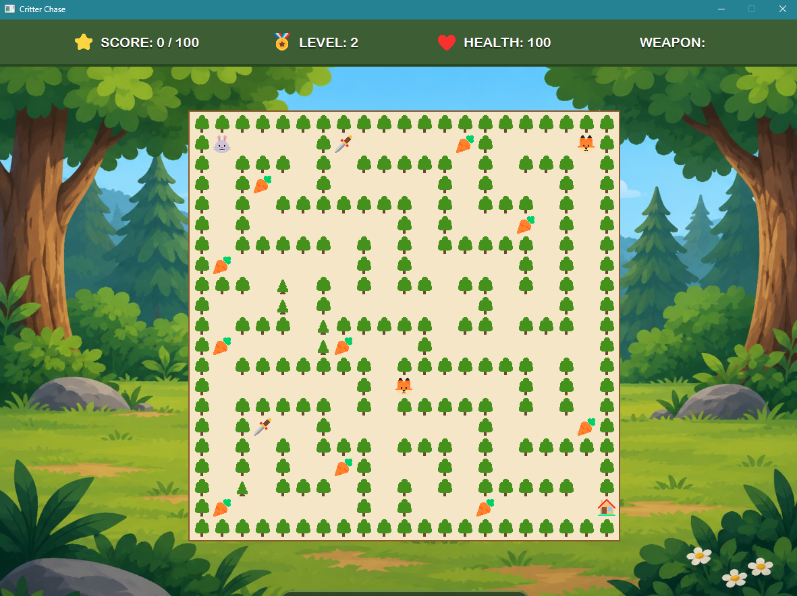
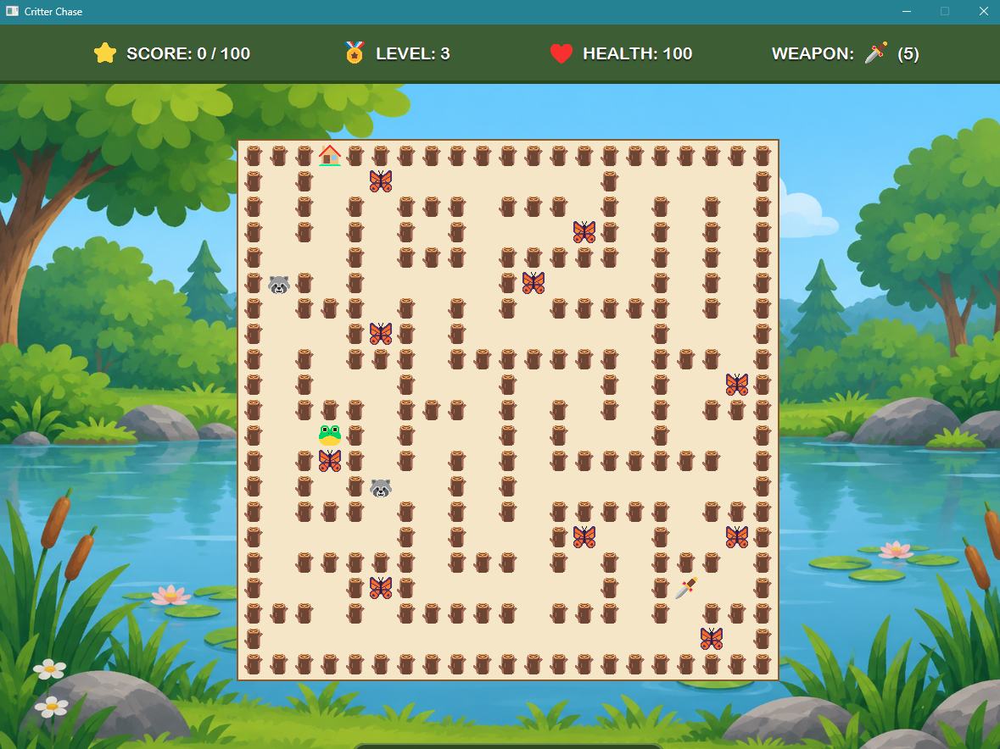
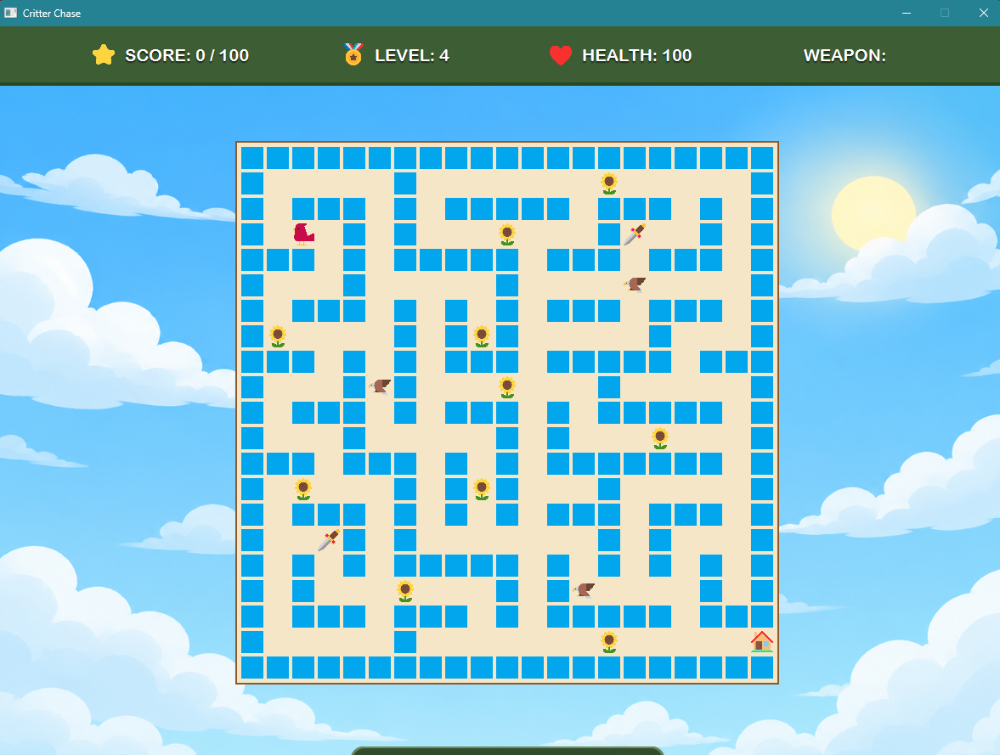
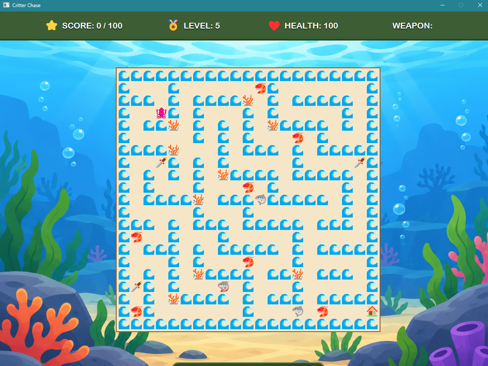
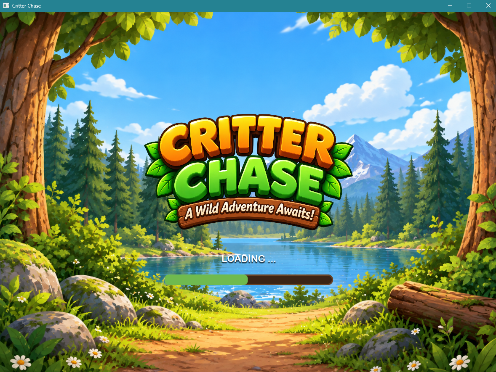
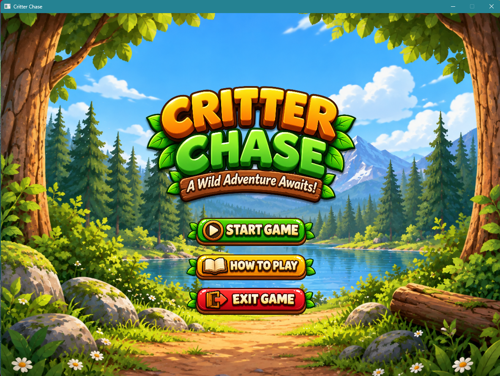

# Critter Chase

Critter Chase is a JavaFX maze game built using the Java programming language. The game challenges players to navigate through five different maze levels, collect food to earn points, avoid or fight enemies, collect weapons, and reach the exit. Each level introduces a different theme, player character, enemies, food, wall designs, and maze layout, with the difficulty increasing as the player progresses.

The game is organized using object-oriented programming principles and separates gameplay responsibilities into different classes, including JavaFX controllers, game management, levels, entities, game objects, maze building, collision handling, combat, enemy movement, and pathfinding.

# Game Features
* Multiple Levels: Players progress through five different themed maze levels.
* Maze Navigation: Players use WASD or Arrow Keys to navigate through the maze.
* Food Collection: Players collect food throughout each maze to earn points.
* Enemies: Players must avoid or fight enemies that move throughout the maze and damage the player upon collision.
* Health System: Players have a limited amount of health and lose health when attacked by enemies.
* Weapons: Players can collect a dagger and use it to attack enemies.
* Score Tracking: The game tracks the player's score for each level and the overall game score.
* Level Progression: Reaching the exit allows the player to advance to the next level.
* Increasing Difficulty: Each level introduces different maze layouts, enemies, and challenges.
* Themed Levels: Each level uses different backgrounds, player characters, enemies, food, walls, and exit designs.
* JavaFX Interface: The game includes a main menu, how-to-play screen, gameplay screen, and game result screen.
* JSON Level Data: Level layouts and assets are stored in JSON files and loaded and validated when the game runs.

## Requirements

- Java Development Kit (JDK) 21
- Apache Maven
- Visual Studio Code or another Java-compatible IDE

### Level 1

* Player: 🐭 Mouse
* Enemy: 🐱
* Food: 🧀 Cheese
* Weapon: 🗡️

### Level 2

* Player: 🐰
* Enemy: 🦊
* Food: 🥕
* Weapon: 🗡️

### Level 3

* Player: 🐸
* Enemy: 🦝
* Food: 🦋
* Weapon: 🗡️

### Level 4

* Player: 🐦
* Enemy: 🦅
* Food: 🌻
* Weapon: 🗡️

### Level 5

* Player: 🦑
* Enemy: 🦈
* Food: 🦐
* Weapon: 🗡️

### Game Menu

The main menu allows the player to:

* **Start Game:** Begin the game and play through the available levels.
* **How to Play:** View the game controls and instructions.
* **Exit:** Exit the game. 

## Verifying Java and Maven Installation
- java -version
- javac -version
- mvn -version

## Running the Game
- mvn clean compile
- mvn javafx:run

## Running the Tests
- mvn test or mvn clean test